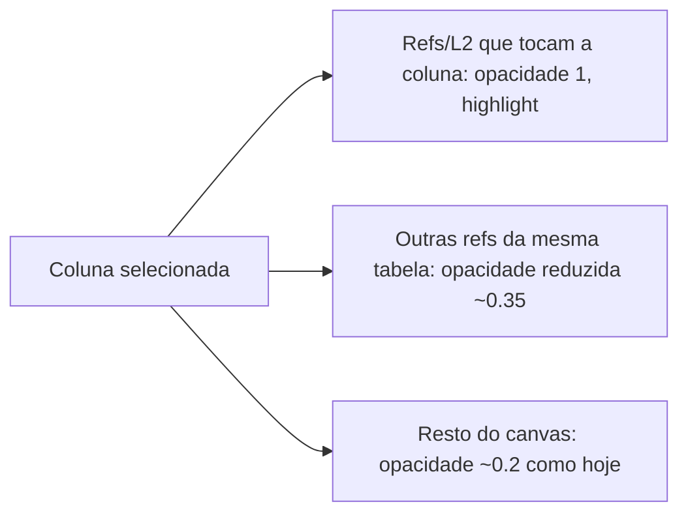

# v11-04 — Export input com `@map` (linhagem L2)

## Problema

O **Export input (Oracle/Spark)** emite metadados L1 (`-- @layer`, `@group`, `@note`, `@origen`, `@fk`) e DDL/INSERT corretos, mas pode **omitir comentários inline `-- @map`** nas colunas silver quando o modelo não tem bloco `LineageFields { }` no DBML — por exemplo:

```sql
-- Esperado (fonte: examples/input/demo_lakehouse_complex.sql):
line_id BIGINT,              -- @map <- raw.erp_order_lines.line_id

-- Obtido quando L2 ausente no modelo:
line_id BIGINT,
```

Sem `@map`, o round-trip **Import (input/) → DBML → Export** perde a linhagem campo-a-campo (L2). O painel **Mapeamentos L2** fica vazio e o canvas não rastreia renomeações ETL (`account_external_id`, etc.).

Relacionado: [`v9-column-lineage.md`](./v9-column-lineage.md) (L2 no DBML/painel), [`v11-03-export-input.md`](./v11-03-export-input.md) (export reverso).

## Estado atual do código

| Peça | Comportamento |
|------|----------------|
| `sqlImport.ts` | Lê `-- @map <- schema.tabela.coluna` inline e popula `model.lineageFields` |
| `dbmlIo.ts` | Serializa `LineageFields { }` no DBML quando `lineageFields` existe |
| `sqlExport.ts` | Emite `@map` inline **se e somente se** `model.lineageFields` contém entrada para a coluna |
| `POST /api/export/input` | `dbmlToModel(dbml)` → `modelToInputSql` — **só vê L2 presente no DBML** |
| `POST /api/import` | `sqlToModel` + `mergeModel` + `modelToDbml` — **deveria** preservar L2 do SQL importado |

Testes existentes (`lineageRoundtrip.test.ts`, `sqlExport.test.ts`) cobrem o fluxo **SQL com `@map` → export Spark** com `demo_lakehouse.sql`. Falta cobertura explícita para **Oracle** e fixture **`demo_lakehouse_complex.sql`**.

## Hipóteses de causa (a validar na implementação)

1. **Modelo sem L2 no DBML** — usuário modelou silver no canvas/editor com `@origen` (L1) mas sem bloco `LineageFields { }` nem edição no painel L2.
2. **Import parcial** — bronze importado de SQL; silver construída na UI; export reflete só o que está no `project.dbml`.
3. **Perda no merge** — import de múltiplos `.sql` sobrescreve ou não funde `lineageFields` (ver `mergeFieldLineageEntries` em `sqlImport.ts`).
4. **Export sem aviso** — UI exporta Oracle sem alertar que N tabelas silver não têm mapeamentos L2.

> **Não é bug de formatação Oracle**: `modelToInputSql(..., 'oracle')` já chama `formatColumnLine` com `fieldMaps`; o gap é **dados ausentes em `lineageFields`**, não o gerador em si.

## Objetivo

Garantir que **Export input (Spark e Oracle)** reproduza fielmente os `-- @map` inline sempre que a linhagem L2 existir no modelo — e oferecer caminhos para **popular L2** quando o usuário modelou só L1.

## Escopo

### Fase A — Diagnóstico e testes de regressão

1. Fixture: `examples/input/demo_lakehouse_complex.sql` (dezenas de `@map`, renomeações, notas ETL).
2. Testes Vitest:
   - `sqlToModel` → `lineageFields` contém mapeamento `silver.stg_order_lines.line_id ← raw.erp_order_lines.line_id`.
   - `modelToInputSql(model, 'oracle')` contém `-- @map <- raw.erp_order_lines.line_id`.
   - Round-trip: import API simulado (`mergeModel` + `modelToDbml` + `dbmlToModel` + export) preserva contagem L2 ≥ 95% da fixture.
3. Documentar no README de `examples/input/` a cadeia `@map` ↔ `LineageFields`.

### Fase B — Persistência import → DBML

1. Auditar `mergeModel` / `mergeFieldLineageEntries`: import de SQL com `@map` nunca descarta entradas L2 já existentes sem regra explícita.
2. Após **Import (input/)**, resposta inclui contagem `lineageFieldCount` (além de `imported`/`warnings`).
3. AC: importar `demo_lakehouse_complex.sql` → DBML gerado contém bloco `LineageFields { ... line_id ... }`.

### Fase C — Export e UX

1. **Oracle + Spark**: paridade de `@map` (mesma lógica; teste Oracle dedicado).
2. Antes de export input, se existir tabela `layer: silver` (ou schema `silver`) **sem nenhum** mapeamento L2 cujo `targetTable` bata com a tabela:
   - toast/aviso: *"Export sem @map: N colunas silver sem LineageFields. Edite Mapeamentos L2 ou importe SQL com @map."*
3. (Opcional) Item no painel Problemas: coluna silver com `@origen` na tabela mas sem `@map` na coluna — severidade `info`.

### Fase D — Inferência assistida (opcional, pós-MVP)

Heurística **opt-in** ("Sugerir @map") no painel L2 ou pós-import:

| Regra | Exemplo |
|-------|---------|
| Mesmo nome de coluna | `silver.stg_order_lines.order_id` ← `raw.erp_order_lines.order_id` |
| `@origen` único na tabela | origem `raw.erp_orders` + coluna homônima |
| Renomeação documentada | aliases conhecidos — **somente com confirmação do usuário** |

Nunca sobrescrever mapeamento L2 existente. Inferência gera rascunho no bloco `LineageFields`, não SQL direto.

### Fase E — Canvas: foco por coluna

**Problema hoje:** em [`src/canvas/Canvas.tsx`](../src/canvas/Canvas.tsx), `focusTables` usa `selectedTableIds`, `focusedFieldMapping`, hover — **não** usa `selectedColumn` ([`src/store/interaction.ts`](../src/store/interaction.ts)). Clicar numa coluna abre o painel mas **não** destaca arestas FK/L1/L2 daquela coluna.

**Comportamento desejado** (espelhar clique na aresta L2):



**Implementação prevista:**

- Estender `focusTables` / `focusedColumn: { table, column }` derivada de `selectedColumn`.
- Em `edgeHighlight` e construção de arestas `relation`:
  - **Primárias:** `sourceHandle === s:col` ou `targetHandle === t:col` (e arestas L2 com handle `fl:s:` / `fl:t:`).
  - **Secundárias:** mesma tabela, outra coluna — classe `edge--muted` (~0.35).
  - **Demais:** `edge--dimmed` (~0.2), padrão atual.
- CSS em [`src/styles.css`](../src/styles.css): tier `edge--muted` entre highlight e dimmed.
- **AC6:** selecionar coluna com FK → aresta FK fica highlighted; outras FKs da tabela mais opacas; demais tabelas dimmed.
- **AC7:** com "Mostrar linhagem de campos" ativo, selecionar coluna mostra arestas L2 da coluna (selected) e opaca outras L2 da mesma tabela.
- Testes: unit em `edgeFocus.ts` ou teste leve em `autolayout.test.ts`.

## Fora de escopo

- Inferência automática silenciosa no export (sem revisão).
- Sincronizar `@map` com comentários `COMMENT ON COLUMN` Oracle.

## Critérios de aceite

- **AC1:** Import de `examples/input/demo_lakehouse_complex.sql` produz DBML com `LineageFields` incluindo `line_id` em `silver.stg_order_lines`.
- **AC2:** Export input **Oracle** desse modelo emite `-- @map <- raw.erp_order_lines.line_id` na linha da coluna.
- **AC3:** Export input **Spark** mantém paridade de `@map` (regressão `demo_lakehouse` + `demo_lakehouse_complex`).
- **AC4:** Round-trip SQL → DBML → export Oracle → reimport preserva ≥ 95% dos `@map` da fixture demo (tolerância documentada para colunas sem origem no bronze).
- **AC5:** UI avisa quando export input for executado com zero `lineageFields` no modelo (ou zero para tabelas silver).
- **AC6:** Selecionar coluna com FK destaca aresta FK da coluna; outras FKs da mesma tabela em opacidade ~0.35; resto ~0.2.
- **AC7:** Com "Mostrar linhagem de campos", selecionar coluna destaca arestas L2 da coluna e atenua outras L2 da mesma tabela.
- **AC8:** Atualizar [`v11-03-export-input.md`](./v11-03-export-input.md) referenciando este doc e AC de `@map`.

## Referências

- Demo canônico: `examples/input/demo_lakehouse_complex.sql` (`@map`, renomeações, notas ETL).
- Demo legado: `examples/input/demo_lakehouse.sql` (cabeçalho documenta `@map`).
- Implementação export: `server/sqlExport.ts` (`fieldMapsForTable`, `formatColumnLine`).
- Implementação import: `server/sqlImport.ts` (`MAP_INLINE_RE`, `extractFieldLineageFromStmt`).

## Ordem sugerida de PRs

1. Contrato + specs sanitizadas (PR0).
2. Testes + fixture demo (Fase A).
3. Merge/import hardening (Fase B).
4. Aviso export + doc v11-03 (Fase C).
5. Foco visual por coluna (Fase E).
6. Inferência assistida (Fase D), se necessário.
